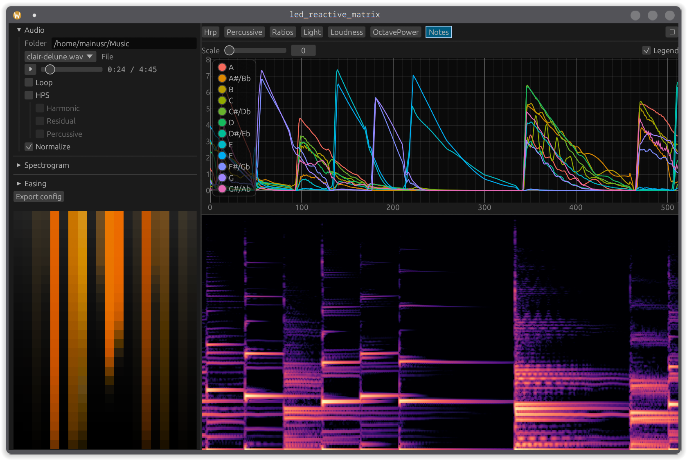

# Reactive LED Matrix

Attempting to represent the human experience of sound with lights.

## Structure

- `config.toml`—general configuration for everything!
- `easing.toml`—easing functions used for lighting effects, usually auto-generated in the app

- `app`—The app with the visualizer for the music → light thing (see above)
- `arduino-agent`—The code that should run on the Arduino to control the lights. This assumes WS281x LEDs with the Adafruit NeoPixel library and communicates over UART.
- `lib`—Headless library which you feed sound data and it outputs the light patterns.
- `plot`—Plots of spectrograms generated with python because why not. You need to export spectrogram images in the app.
- `uart-controller`—Uses UART to control the arduino! (WIP)
